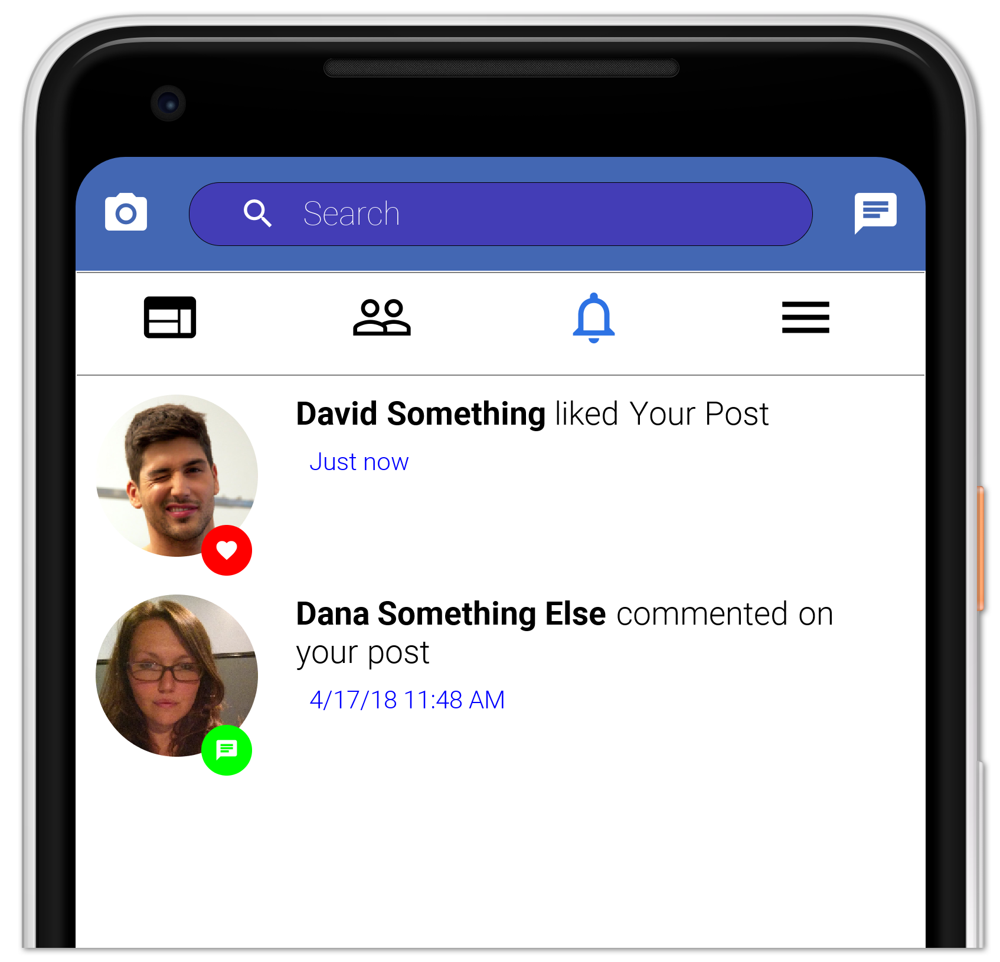

# Facebook Clone

This is a Facebook clone app created as part of the online course which is available online for free [here](https://debugagent.com/series/cn1). The clone also includes a server component available [here](https://github.com/codenameone/FacebookCloneServer).

While this code is functional it is meant as a tutorial and not as a final product. Furthermore, it was written in a version of [Codename One](https://www.codenameone.com) that predated the migration to Maven. The code should be [migrated to Maven](https://www.codenameone.com/blog/migrating-your-project-to-maven.html) to work properly in newer IDEs. It is left in this form so it will align correctly with the course.

**Warning:** Some of the sceenshots below feature black text and don't display well in dark mode.

